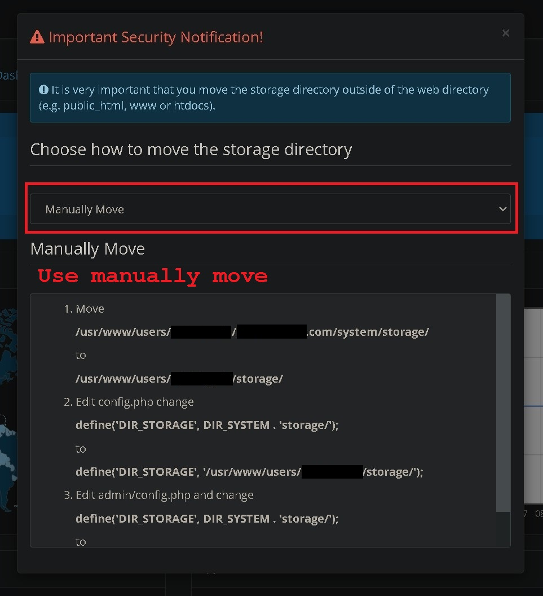

# Setting up OpenCart on Xneelo Shared Hosting South Africa

[](img/4.jpg)

* [Xneelo](https://xneelo.co.za "xneelo link")
* [OpenCart](https://opencart.com "opencart link")

_Feb 2023_

I would suggest using version `3.0.3.8` for live online stores, it uses `PHP8.0` and works decently.
follow the instructions when you browse to the install page.

Rename the `config-dist.php` to `config.php` and also rename `admin/config-dist.php` to `admin/config.php`

Add your **DB** and **Admin** user details.

Then login to the backend for the first time.

[](img/1.jpg)

When first logging in to the OpenCart system. You will have to move the _storage dir_ out of the _system dir_ in the _web directory_

With the way Xneelo has setup their web hosting you will have to do it manually in order to do it properly.

*PLEASE NOTE: All the options in green from the auto script are wrong you may be tempted to just use it to automatically move all directories but you are opening up vulnerabilities!!!

The automatically move options will either break the install or still put your folder in a directory that can be accessed via the web!

[](img/2.jpg)

Here are my steps below that work well for the shared hosting packages with Xneelo.

### 1 Move
```
/usr/www/users/FTP_username/my.domain.com/system/storage/
```
to
```
/usr/home/FTP_username/storage/
```
### 2 Edit config.php change
```PHP
define('DIR_STORAGE', DIR_SYSTEM . 'storage/');
```
to
```PHP
define('DIR_STORAGE', '/usr/home/FTP_username/storage/');
```
### 3 Edit admin/config.php and change
```PHP
define('DIR_STORAGE', DIR_SYSTEM . 'storage/');
```
to
```PHP
define('DIR_STORAGE', '/usr/home/FTP_username/storage/');
```

[](img/3.jpg)